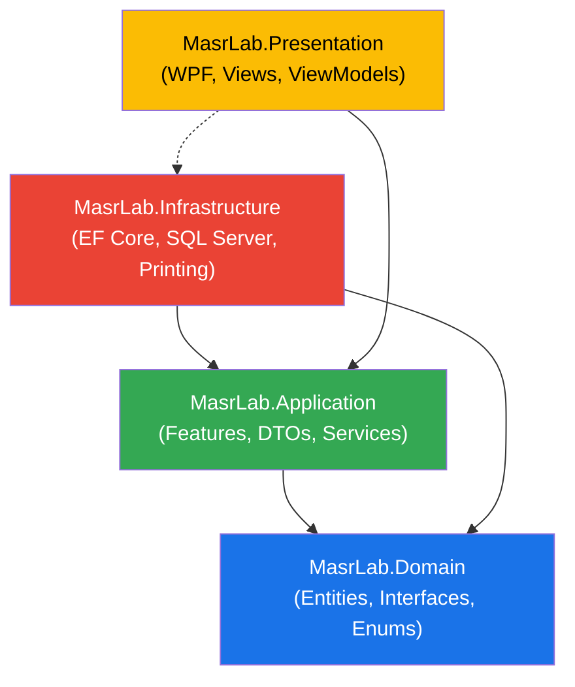

# تقرير تحليل مواصفات MasrLab واقتراح هيكل المشروع

---

## الجزء الأول: حكم الاكتمال

### ✅ الحكم: **كامل — جاهز لبناء هيكل المشروع**

ملف المواصفات [MasrLab_Specifications_and_Audit.md](file:///C:/Users/LAP LINK/source/repos/MasrLab/Docs/MasrLab_Specifications_and_Audit.md) يحتوي على معلومات **كافية ومتكاملة** لتمكين مهندس برمجيات من البدء مباشرة في بناء هيكل المشروع (Project Structure) دون الحاجة لطلب أي معلومات إضافية.

**المبررات الرئيسية:**
1. الملف يغطي **21 وحدة وظيفية (Module)** بتفاصيلها الكاملة (الغرض، الموديولات الفرعية، الميزات الوظيفية).
2. **30 كياناً (Entity)** معرّفة مع حقولها وأنواعها بدقة، بما في ذلك الكيان الوسيط `VisitTest` والكيان المشتق `PatientHistory`.
3. **27 علاقة** بين الكيانات محددة بوضوح مع نوع العلاقة (1:1، 1:N، M:N) والمفاتيح الأجنبية.
4. سياسة الحذف (`Soft Delete` / `Hard Delete`) وأعمدة التدقيق العامة محددة بشكل صريح ومفصّل (القسم 7.3).
5. **5 فجوات** تم رصدها وحلّها بقرارات تصميمية موثقة في الجزء الثالث من الملف (Gap Resolution Decisions).
6. البيئة التقنية محددة بالكامل: WPF / .NET 8 / SQL Server / MVVM / LAN / RTL.

---

## الجزء الثاني: تفاصيل التقييم حسب البنود الحرجة

| # | البند | مستوى الاكتمال | التقييم | الأدلة |
|:---:|:---|:---:|:---|:---|
| 1 | **الموديولات الوظيفية** | ✅ مكتمل 100% | 21 وحدة محددة بالكامل: 9 أساسية + 7 إدارية + 3 مالية + 1 إحصائية + 1 إعدادات. كل وحدة موصوفة بـ: الغرض، الموديولات الفرعية، الميزات الوظيفية | الأسطر 28–514 |
| 2 | **الكيانات (الجداول) مع حقولها وأنواعها** | ✅ مكتمل 100% | 30 كياناً معرّفاً بحقولها بالتفصيل. الكيانات الحرجة (VisitTest, TestResult, Receipt) تحتوي على تحديد نوع البيانات صريح (INT, DECIMAL(18,2), NVARCHAR, BIT, DATETIME2, DATE). الكيانات المستبعدة (9 كيانات) موثقة مع أسباب الاستبعاد | الأسطر 518–904 |
| 3 | **العلاقات بين الكيانات** | ✅ مكتمل 100% | 27 علاقة محددة بالنوع (1:1, 1:N, M:N) ومعرّفة بالمفاتيح الأجنبية. العلاقة M:N بين PatientVisit و Test محلولة عبر كيان وسيط VisitTest (6a/6b/6c). الفجوة الأصلية (غياب كيان وسيط) تم سدها | الأسطر 909–942 |
| 4 | **أدوار المستخدمين والصلاحيات** | ✅ مكتمل 100% | دوران واضحان (Admin / User) بعلم `IsAdmin`. لا يوجد كيان Role منفصل — الصلاحيات فردية لكل مستخدم لكل شاشة/عملية. 13 صلاحية محددة بالتفصيل في مصفوفة الصلاحيات. رسالة رفض الصلاحية محددة | الأسطر 947–1007 |
| 5 | **الميزات الوظيفية لكل موديول** | ✅ مكتمل 100% | كل موديول يحتوي قائمة ميزات تفصيلية (bullet points). الميزات تشمل: العمليات المتاحة، سير العمل، القيود، الاحتساب التلقائي (High/Low, Remaining)، وقواعد الأعمال | الأسطر 48–512 |
| 6 | **التقارير المطلوبة** | ✅ مكتمل 100% | 20 تقريراً محدداً بالاسم والغرض والوحدة المرتبطة وإمكانية التصدير. صيغة الإخراج: طباعة مباشرة فقط (لا Word/PDF). التقارير تشمل: نتائج فردية، مجمعة، فارغة، مزارع، تاريخ مرضي، أوراق عمل، إحصائيات، جرد، حضور | الأسطر 1012–1040 |
| 7 | **متطلبات قاعدة البيانات** | ✅ مكتمل 100% | **سياسة الحذف:** Soft Delete إلزامي لـ 15 كياناً، Hard Delete بشرط لـ 6 كيانات، لا حذف لـ 4 كيانات إعدادات. **سجل التدقيق:** 5 أعمدة قياسية على جميع كيانات الأعمال + كيان AuditLog مستقل. **المصادقة:** كلمة مرور لكل مستخدم + كلمة مرور إضافية للجرد. **عملة ثابتة** (EGP). **فرع واحد**. **مستخدمون متزامنون**. **نسخ احتياطي يومي** | الأسطر 1045–1125 |
| 8 | **متطلبات التنقل والواجهة** | ✅ مكتمل 100% | نمط تنقل بالأيقونات (9 أيقونات رئيسية). تخطيط الشاشة محدد (قائمة يسرى، قائمة يمنى، فلاتر بحث، أزرار قياسية، تخطيط ثنائي اللوح). سير العمل محدد بـ 9 خطوات. واجهة عربية RTL. شعار MasrLab | الأسطر 1184–1223 |
| 9 | **التكاملات المطلوبة والمستبعدة** | ✅ مكتمل 100% | 3 تكاملات معتمدة (Lab-to-Lab, Printers, Barcode). 6 تكاملات مستبعدة صراحة (SMS, HL7/ASTM, Email, REST API, Cloud, Mobile) | الأسطر 1168–1183 |
| 10 | **متطلبات خاصة أخرى** | ✅ مكتمل 100% | 24 متطلباً خاصاً محدداً: RTL, حقول ثنائية اللغة, باركود, أحجام ورق, طابعات متعددة, مستخدمون متزامنون, قيم مرجعية مخصصة, خصم/عمولة, Lab ID, إلخ | الأسطر 1139–1167 |

> [!NOTE]
> الملف يتضمن أيضاً **الجزء الثالث** (قرارات سد الفجوات) الذي يوثق 5 فجوات تم رصدها وحلّها بقرارات تصميمية واضحة (الأسطر 1231–1242)، مما يرفع مستوى الاكتمال إلى 100%.

---

## الجزء الثالث: الهيكل المقترح (Project Structure)

> [!IMPORTANT]
> هذا الهيكل مقترح مستقل تماماً مبني حصرياً على تحليل ملف المواصفات. لم يتم تنفيذه فعلياً ولم يتم تعديل أي ملف أو كود.

### المعمارية المختارة: Clean Architecture مع MVVM

**سبب الاختيار:**
- Clean Architecture تفصل بين طبقات الأعمال (Business Logic) والبنية التحتية (Infrastructure) والعرض (Presentation)، مما يتيح اختبار وصيانة أفضل.
- MVVM هو النمط المطلوب صراحة في المواصفات ومتوافق طبيعياً مع WPF.
- الفصل بين الطبقات يدعم المتطلب الخاص بالمستخدمين المتزامنين على LAN (القسم 7.8).
- يتيح استبدال طبقة البنية التحتية (مثلاً: تغيير ORM أو قاعدة البيانات) دون التأثير على منطق الأعمال.

---

### هيكل الحل (Solution Structure)

```
MasrLab.sln
│
├── src/
│   ├── MasrLab.Domain/                          ← طبقة النطاق (Domain Layer)
│   ├── MasrLab.Application/                     ← طبقة التطبيق (Application Layer)
│   ├── MasrLab.Infrastructure/                  ← طبقة البنية التحتية (Infrastructure Layer)
│   └── MasrLab.Presentation/                    ← طبقة العرض (Presentation Layer — WPF)
│
└── tests/
    ├── MasrLab.Domain.Tests/                    ← اختبارات طبقة النطاق
    ├── MasrLab.Application.Tests/               ← اختبارات طبقة التطبيق
    └── MasrLab.Infrastructure.Tests/            ← اختبارات طبقة البنية التحتية
```

---

### تفصيل كل مشروع (Project)

---

#### 1. `MasrLab.Domain` — طبقة النطاق

> **التبرير:** الطبقة الأكثر استقلالية — لا تعتمد على أي مشروع آخر. تحتوي على الكيانات (Entities)، القواعد التجارية (Business Rules)، والعقود (Interfaces) الأساسية. هذا يضمن أن منطق الأعمال غير مقترن بقاعدة البيانات أو الواجهة.

```
MasrLab.Domain/
│
├── Common/                                      ← عناصر مشتركة عبر جميع الكيانات
│   ├── BaseEntity.cs                            ← الكيان الأساسي (Id, CreatedAt, CreatedByUserId, UpdatedAt, UpdatedByUserId, IsDeleted)
│   │                                               — مبني على سياسة أعمدة التدقيق العامة (القسم 7.3.2)
│   ├── IAuditableEntity.cs                      ← واجهة لأعمدة التدقيق
│   ├── ISoftDeletable.cs                        ← واجهة للحذف المنطقي
│   └── Enums/                                   ← التعدادات المشتركة
│       ├── Gender.cs                            ← ذكر / أنثى (Entity 1: Patient.Gender)
│       ├── AccountType.cs                       ← نقدي / تأمين / تعاقد (Entity 1: Patient.AccountType)
│       ├── VisitStatus.cs                       ← مسجلة / نتائج مدخلة / مطبوعة (Entity 2: PatientVisit.Status)
│       ├── SampleStatus.cs                      ← مسحوبة / غير مسحوبة (Entity 2: PatientVisit.SampleStatus)
│       ├── ResultStatus.cs                      ← High / Low / Normal (Entity 5: TestResult.Status)
│       ├── SensitivityLevel.cs                  ← Highly Sensitive / Moderate / Low / Resistant (Entity 14)
│       ├── ReferralEntityType.cs                ← طبيب معالج / عينات مرسلة / جهة إحالة أو تعاقد (Entity 24)
│       ├── TransactionType.cs                   ← صرف / إيداع (Entity 17: CashTransaction.Type)
│       ├── AuditActionType.cs                   ← إدخال / تعديل / طباعة (Entity 22: AuditLog.ActionType)
│       ├── AuditEntityType.cs                   ← حالة / نتيجة / تقرير (Entity 22: AuditLog.EntityType)
│       ├── PrinterPurposeType.cs                ← تقارير / باركود / إيصال / ظرف (Entity 28)
│       ├── PaperSize.cs                         ← A4 / A5 (القسم 7.6)
│       ├── AgeUnit.cs                           ← سنوات / أشهر / أيام (Entity 6: ReferenceValue.AgeUnit)
│       └── WorkSheetType.cs                     ← مرضى / تحاليل (Entity 30: WorkSheet.Type)
│
├── Entities/                                    ← الكيانات (مطابقة للقسم 2 من المواصفات)
│   │
│   ├── Core/                                    ← الكيانات الجوهرية (القسم 2.1)
│   │   ├── Patient.cs                           ← Entity 1: المريض — 15 حقلاً
│   │   ├── PatientVisit.cs                      ← Entity 2: زيارة المريض — 8 حقول
│   │   ├── VisitTest.cs                         ← Entity 2-Junction: تحليل الزيارة — 12 حقلاً (كيان وسيط)
│   │   ├── Test.cs                              ← Entity 4: التحليل — 10 حقول
│   │   ├── TestResult.cs                        ← Entity 5: نتيجة التحليل — 15 حقلاً
│   │   ├── ReferenceValue.cs                    ← Entity 6: القيمة المرجعية — 8 حقول
│   │   ├── TestGroup.cs                         ← Entity 7: مجموعة التحاليل — 3 حقول
│   │   ├── TestGroupItem.cs                     ← كيان ربط M:N بين TestGroup و Test (العلاقة 9)
│   │   ├── Comment.cs                           ← Entity 8: الكومنت الثابت — 3 حقول
│   │   ├── Sample.cs                            ← Entity 9: العينة — 6 حقول
│   │   └── SampleCollection.cs                  ← Entity 10: سحب العينة — 5 حقول
│   │
│   ├── Culture/                                 ← كيانات المزارع (القسم 2.1 — Entities 11–14)
│   │   ├── Culture.cs                           ← Entity 11: المزرعة — 7 حقول
│   │   ├── Organism.cs                          ← Entity 12: الكائن الحي — 2 حقل
│   │   ├── Antibiotic.cs                        ← Entity 13: المضاد الحيوي — 3 حقول
│   │   └── Sensitivity.cs                       ← Entity 14: الحساسية — 3 حقول (كيان M:N)
│   │
│   ├── Financial/                               ← الكيانات المالية (القسم 2.2)
│   │   ├── Receipt.cs                           ← Entity 15: الإيصال — 12 حقلاً (العملة ثابتة EGP)
│   │   ├── Account.cs                           ← Entity 16: الحساب/الدرج — 9 حقول
│   │   ├── CashTransaction.cs                   ← Entity 17: صرف/إيداع — 6 حقول
│   │   └── OutsourcedSample.cs                  ← Entity 18: العينة المرسلة — 6 حقول
│   │
│   ├── Administrative/                          ← الكيانات الإدارية (القسم 2.3)
│   │   ├── User.cs                              ← Entity 19: المستخدم — 5 حقول
│   │   ├── Permission.cs                        ← Entity 20: الصلاحية — 4 حقول
│   │   ├── AttendanceLog.cs                     ← Entity 21: سجل الحضور — 7 حقول
│   │   ├── AuditLog.cs                          ← Entity 22: سجل التدقيق — 7 حقول
│   │   ├── Doctor.cs                            ← Entity 23: الطبيب — 5 حقول
│   │   └── ReferralEntity.cs                    ← Entity 24: جهة الإحالة — 9 حقول
│   │
│   └── Settings/                                ← كيانات الإعدادات (القسم 2.4)
│       ├── PriceList.cs                         ← Entity 25: قائمة الأسعار — 2 حقل
│       ├── PriceListItem.cs                     ← Entity 26: بند قائمة الأسعار — 4 حقول
│       ├── SystemSetting.cs                     ← Entity 27: إعدادات النظام — Key/Value
│       ├── Printer.cs                           ← Entity 28: الطابعة — 3 حقول
│       ├── ReportTemplate.cs                    ← Entity 29: قالب التقرير — 8 حقول
│       └── WorkSheet.cs                         ← Entity 30: ورقة العمل — 5 حقول
│
├── Interfaces/                                  ← عقود المستودعات (Repository Contracts)
│   ├── IRepository.cs                           ← عقد مستودع عام (Generic Repository)
│   ├── IUnitOfWork.cs                           ← عقد وحدة العمل (Unit of Work)
│   ├── IPatientRepository.cs                    ← عقد خاص بالمريض (بحث متعدد المعايير — Module 4)
│   ├── IVisitRepository.cs                      ← عقد خاص بالزيارات (متابعة الحالات — Module 5)
│   ├── ITestResultRepository.cs                 ← عقد خاص بالنتائج (إدخال النتائج — Module 2)
│   ├── ICultureRepository.cs                    ← عقد خاص بالمزارع (Module 3)
│   ├── IAccountingRepository.cs                 ← عقد خاص بالجرد والمحاسبة (Modules 17–19)
│   ├── IStatisticsRepository.cs                 ← عقد خاص بالإحصائيات (Module 20)
│   └── IAuditLogRepository.cs                   ← عقد خاص بسجل التدقيق (Module 16)
│
└── Exceptions/                                  ← استثناءات النطاق
    ├── EntityNotFoundException.cs               ← كيان غير موجود
    ├── BusinessRuleViolationException.cs         ← انتهاك قاعدة أعمال
    ├── InsufficientPermissionException.cs        ← رسالة "لا توجد لديك صلاحية..." (القسم 5)
    └── DuplicateLabIdException.cs               ← تكرار Lab ID
```

**تبرير التصنيف الفرعي:**
- `Core/` يجمع الكيانات الأساسية (Patient, Visit, Test, Result, Sample) لأنها تمثل صلب عمل المعمل.
- `Culture/` مفصول لأنه مجال فرعي مستقل (Microbiology) بعلاقات خاصة (Organism, Antibiotic, Sensitivity).
- `Financial/` مفصول لأن الكيانات المالية لها دورة حياة وقواعد مختلفة (Receipt, Account, CashTransaction).
- `Administrative/` يجمع كيانات الإدارة (User, Permission, Doctor, Attendance, Audit).
- `Settings/` يجمع كيانات التكوين التي لا تتبع سياسة Soft Delete.

---

#### 2. `MasrLab.Application` — طبقة التطبيق

> **التبرير:** تحتوي على منطق التطبيق (Use Cases / Services) الذي ينسّق بين الكيانات والمستودعات. تعتمد فقط على `MasrLab.Domain`. لا تعتمد على البنية التحتية أو الواجهة. تتبع مبدأ Dependency Inversion.

```
MasrLab.Application/
│
├── Common/                                      ← عناصر مشتركة لطبقة التطبيق
│   ├── Interfaces/
│   │   ├── ICurrentUserService.cs               ← خدمة المستخدم الحالي (لأعمدة التدقيق)
│   │   ├── IDateTimeService.cs                  ← خدمة الوقت (لأعمدة CreatedAt/UpdatedAt)
│   │   ├── IAuthenticationService.cs            ← خدمة المصادقة (كلمة المرور — القسم 7.1)
│   │   └── IPrintService.cs                     ← خدمة الطباعة (4 طابعات — القسم 7.12 متطلب 5)
│   ├── DTOs/                                    ← كائنات نقل البيانات
│   │   ├── PatientDto.cs
│   │   ├── VisitDto.cs
│   │   ├── TestResultDto.cs
│   │   ├── ReceiptDto.cs
│   │   ├── CultureResultDto.cs
│   │   ├── PatientHistoryDto.cs                 ← DTO للكيان المشتق (Entity 3 — SQL View)
│   │   ├── StatisticsDto.cs
│   │   ├── WorkSheetDto.cs
│   │   ├── AttendanceDto.cs
│   │   └── AccountDrawerDto.cs
│   ├── Mappings/                                ← تحويلات Entity ↔ DTO
│   │   └── MappingProfile.cs
│   └── Behaviors/                               ← سلوكيات عامة (Validation, Logging)
│       ├── ValidationBehavior.cs
│       └── AuditBehavior.cs                     ← تسجيل تلقائي في AuditLog (القسم 7.2)
│
├── Features/                                    ← الوظائف مقسّمة حسب الموديولات (مطابقة للقسم 1)
│   │
│   ├── PatientManagement/                       ← Module 1: إدارة المرضى
│   │   ├── Commands/
│   │   │   ├── RegisterPatient/                 ← Submodule 1-1: إضافة مريض جديد
│   │   │   ├── UpdatePatientAccount/            ← Submodule 1-2: التعديل في حساب المريض
│   │   │   ├── DeliverResults/                  ← Submodule 1-3: تسليم النتائج وتصفية الحساب
│   │   │   └── UpdatePatientData/               ← Submodule 1-4: تعديل بيانات مريض أو تحاليله
│   │   └── Queries/
│   │       ├── GetPatientById/
│   │       └── GenerateLabId/                   ← توليد كود Lab ID الفريد (متطلب 23)
│   │
│   ├── ResultsEntry/                            ← Module 2: إدخال النتائج والتقارير
│   │   ├── Commands/
│   │   │   ├── EnterTestResult/                 ← Submodule 1-5: إدخال نتائج (رقمية/نصية/اختيارية)
│   │   │   ├── CreateCombinedReport/            ← Submodule 1-6: تقرير مجمع
│   │   │   └── CreateBlankReport/               ← Submodule 1-7: تقرير فارغ
│   │   └── Queries/
│   │       ├── GetTestResultForVisit/
│   │       └── CalculateHighLowStatus/          ← حساب High/Low تلقائياً (مقارنة مع ReferenceValue)
│   │
│   ├── Cultures/                                ← Module 3: المزارع والحساسية
│   │   ├── Commands/
│   │   │   ├── EnterCultureResult/              ← Submodule 1-8: إدخال نتائج المزارع
│   │   │   ├── AddNewCulture/                   ← Submodule 3-8: إضافة مزرعة جديدة (Master Data)
│   │   │   └── AddAntibioticToCulture/          ← Submodule 3-9: إضافة مضاد حيوي
│   │   └── Queries/
│   │       ├── GetCultureResult/
│   │       └── FilterAntibiotics/               ← فلترة المضادات حسب حمل/أطفال (متطلب 22)
│   │
│   ├── PatientSearch/                           ← Module 4: البحث وسجل الزيارات
│   │   └── Queries/
│   │       ├── SearchPatients/                  ← بحث متعدد المعايير (8 معايير — Submodule 1-9)
│   │       └── GetPatientVisitHistory/          ← Submodule 1-10: جميع زيارات المريض
│   │
│   ├── CasesFollowUp/                           ← Module 5: متابعة الحالات
│   │   └── Queries/
│   │       ├── GetCasesByPeriod/                ← عرض الحالات في فترة محددة مع الحالة
│   │       └── GetCaseUserTracking/             ← عرض اسم المستخدم المدخل
│   │
│   ├── PatientHistory/                          ← Module 6: التاريخ المرضي
│   │   └── Queries/
│   │       └── GetPatientHistory/               ← الكيان المشتق — SQL View (Entity 3)
│   │
│   ├── WorkSheets/                              ← Module 7: أوراق العمل
│   │   └── Queries/
│   │       ├── GeneratePatientWorkSheet/        ← Submodule 2-1: ورقة عمل بالمرضى
│   │       ├── GenerateTestWorkSheet/           ← Submodule 2-2: ورقة عمل بالتحاليل
│   │       └── GenerateTestLog/                 ← تصنيف التحاليل (LOG)
│   │
│   ├── SampleCollection/                        ← Module 8: سحب وفصل العينات
│   │   ├── Commands/
│   │   │   └── MarkSampleCollected/             ← تسجيل العينة كمسحوبة
│   │   └── Queries/
│   │       └── GetPendingSamples/               ← عرض العينات غير المسحوبة
│   │
│   ├── OutsourcedSamples/                       ← Module 9: العينات المرسلة للخارج
│   │   ├── Commands/
│   │   │   ├── MarkTestAsOutsourced/            ← Submodule 3-10: تحديد التحاليل المرسلة
│   │   │   └── SettleOutsourcedAccount/         ← Submodule 6-4: تصفية حساب العينات
│   │   └── Queries/
│   │       └── GetOutsourcedSamples/
│   │
│   ├── TestsMasterData/                         ← Module 10: بيانات التحاليل الرئيسية
│   │   ├── Commands/
│   │   │   ├── AddTest/                         ← Submodule 3-1: إضافة تحليل جديد
│   │   │   ├── UpdateTest/                      ← تعديل بيانات/أسعار التحليل
│   │   │   └── UpdateReferenceValues/           ← Submodule 3-2: تعديل القيم المرجعية
│   │   └── Queries/
│   │       └── GetTestWithReferences/
│   │
│   ├── PriceLists/                              ← Module 11: قوائم الأسعار
│   │   ├── Commands/
│   │   │   ├── CreatePriceList/                 ← Submodule 3-3: إضافة قائمة أسعار
│   │   │   └── UpdatePriceListItems/
│   │   └── Queries/
│   │       └── GetPriceListForPrint/            ← Submodule 3-4: طباعة القائمة
│   │
│   ├── FixedComments/                           ← Module 12: الكومنتات الثابتة
│   │   └── Commands/
│   │       └── ManageComments/
│   │
│   ├── TestGroups/                              ← Module 13: مجموعات التحاليل المخصصة
│   │   └── Commands/
│   │       └── ManageTestGroups/
│   │
│   ├── DoctorsAndReferrals/                     ← Module 14: الأطباء وجهات الإحالة
│   │   └── Commands/
│   │       ├── AddDoctor/                       ← Submodule 3-7-1
│   │       └── AddReferralEntity/               ← Submodule 3-7-2
│   │
│   ├── UsersAndPermissions/                     ← Module 15: المستخدمون والصلاحيات
│   │   ├── Commands/
│   │   │   ├── CreateUser/
│   │   │   ├── UpdateUser/
│   │   │   └── SetPermissions/                  ← تحديد صلاحيات (13 صلاحية — القسم 5)
│   │   └── Queries/
│   │       └── CheckPermission/                 ← التحقق من صلاحية الوصول
│   │
│   ├── AttendanceAndAudit/                      ← Module 16: الحضور والانصراف وسجل التدقيق
│   │   ├── Commands/
│   │   │   ├── RecordLogin/
│   │   │   ├── RecordLogout/
│   │   │   └── RecordBreak/
│   │   └── Queries/
│   │       ├── GetAttendanceLogs/
│   │       └── GetAuditLogs/
│   │
│   ├── Accounting/                              ← Modules 17–19: الوحدات المالية
│   │   ├── Commands/
│   │   │   ├── CreatePeriodDrawer/              ← Module 17: الجرد الفتري
│   │   │   ├── CreateDoctorDrawer/              ← Module 18: جرد الطبيب/الجهة
│   │   │   ├── CreateAccountTypeDrawer/         ← Module 19: جرد نوع الحساب
│   │   │   └── RecordCashTransaction/           ← صرف/إيداع نقدي
│   │   └── Queries/
│   │       ├── GetDrawerReport/
│   │       └── GetDoctorReferralReport/
│   │
│   ├── Statistics/                              ← Module 20: الإحصائيات
│   │   └── Queries/
│   │       ├── GetGenderStatistics/             ← Submodule 5-1: فرز بالجنس
│   │       ├── GetMonthlyStatistics/            ← Submodule 5-1: فرز بالشهور
│   │       ├── GetPatientCountByPeriod/         ← Submodule 5-2: عدد المرضى
│   │       ├── GetTestDemandRate/               ← Submodule 5-3: معدل طلب تحليل
│   │       └── GetSampleCountByYear/            ← Submodule 5-4: عدد العينات
│   │
│   └── SystemSettings/                          ← Module 21: إعدادات النظام
│       ├── Commands/
│       │   ├── UpdateReportSettings/            ← Submodules 7-1 إلى 7-5
│       │   ├── UpdatePrinterSettings/           ← Submodule 7-6
│       │   ├── UpdateAccountSettings/           ← Submodule 7-7
│       │   ├── UpdateReceiptSettings/           ← Submodule 7-8
│       │   ├── UpdateEnvelopeBarcodeSettings/   ← Submodule 7-9
│       │   └── ManageBackup/                    ← نسخ احتياطي (القسم 7.9)
│       └── Queries/
│           └── GetSystemSettings/
│
└── DependencyInjection.cs                       ← تسجيل خدمات طبقة التطبيق في DI
```

**تبرير تقسيم Features:**
- كل مجلد في `Features/` يطابق موديولاً واحداً من القسم 1 في المواصفات، مما يسهّل التتبع والصيانة.
- نمط CQRS (Command/Query) يفصل عمليات الكتابة (Commands) عن القراءة (Queries)، مما يتوافق مع طبيعة النظام (إدخال بيانات + تقارير).
- الموديولات المالية (17–19) مجمعة في `Accounting/` لأنها تشترك في نفس الكيانات المالية (Account, CashTransaction, Receipt).

---

#### 3. `MasrLab.Infrastructure` — طبقة البنية التحتية

> **التبرير:** تحتوي على التطبيق الفعلي للعقود المعرّفة في `Domain` و`Application`. تعتمد على `MasrLab.Domain` و`MasrLab.Application`. هنا يتم ربط النظام بـ SQL Server وباقي البنية التحتية (طباعة، باركود، نسخ احتياطي).

```
MasrLab.Infrastructure/
│
├── Persistence/                                 ← الوصول لقاعدة البيانات
│   ├── MasrLabDbContext.cs                      ← سياق EF Core — يشمل جميع الـ DbSets
│   ├── Configurations/                          ← إعدادات Fluent API لكل كيان
│   │   ├── Core/
│   │   │   ├── PatientConfiguration.cs
│   │   │   ├── PatientVisitConfiguration.cs
│   │   │   ├── VisitTestConfiguration.cs        ← الكيان الوسيط — مفاتيح مركبة + FK
│   │   │   ├── TestConfiguration.cs
│   │   │   ├── TestResultConfiguration.cs
│   │   │   ├── ReferenceValueConfiguration.cs
│   │   │   ├── TestGroupConfiguration.cs
│   │   │   ├── TestGroupItemConfiguration.cs    ← M:N بين TestGroup و Test
│   │   │   ├── CommentConfiguration.cs
│   │   │   ├── SampleConfiguration.cs
│   │   │   └── SampleCollectionConfiguration.cs
│   │   ├── Culture/
│   │   │   ├── CultureConfiguration.cs
│   │   │   ├── OrganismConfiguration.cs
│   │   │   ├── AntibioticConfiguration.cs
│   │   │   └── SensitivityConfiguration.cs      ← M:N بين Culture و Antibiotic
│   │   ├── Financial/
│   │   │   ├── ReceiptConfiguration.cs
│   │   │   ├── AccountConfiguration.cs
│   │   │   ├── CashTransactionConfiguration.cs
│   │   │   └── OutsourcedSampleConfiguration.cs
│   │   ├── Administrative/
│   │   │   ├── UserConfiguration.cs
│   │   │   ├── PermissionConfiguration.cs
│   │   │   ├── AttendanceLogConfiguration.cs
│   │   │   ├── AuditLogConfiguration.cs
│   │   │   ├── DoctorConfiguration.cs
│   │   │   └── ReferralEntityConfiguration.cs
│   │   └── Settings/
│   │       ├── PriceListConfiguration.cs
│   │       ├── PriceListItemConfiguration.cs
│   │       ├── SystemSettingConfiguration.cs
│   │       ├── PrinterConfiguration.cs
│   │       ├── ReportTemplateConfiguration.cs
│   │       └── WorkSheetConfiguration.cs
│   │
│   ├── Repositories/                            ← تطبيق المستودعات
│   │   ├── GenericRepository.cs                 ← المستودع العام (CRUD + Soft Delete filter)
│   │   ├── PatientRepository.cs                 ← بحث متعدد المعايير (Module 4)
│   │   ├── VisitRepository.cs                   ← متابعة الحالات (Module 5)
│   │   ├── TestResultRepository.cs
│   │   ├── CultureRepository.cs
│   │   ├── AccountingRepository.cs
│   │   ├── StatisticsRepository.cs              ← استعلامات إحصائية مُحسَّنة
│   │   └── AuditLogRepository.cs
│   │
│   ├── Views/                                   ← SQL Views
│   │   └── PatientHistoryView.sql               ← Entity 3 — SQL View للتاريخ المرضي
│   │
│   ├── UnitOfWork.cs                            ← تطبيق وحدة العمل
│   │
│   ├── Interceptors/                            ← EF Core Interceptors
│   │   ├── AuditableEntityInterceptor.cs        ← ملء CreatedAt/UpdatedAt/CreatedByUserId تلقائياً
│   │   └── SoftDeleteInterceptor.cs             ← اعتراض Delete وتحويله لـ Soft Delete
│   │
│   ├── Migrations/                              ← EF Core Migrations
│   │
│   └── Seeding/                                 ← بيانات أولية
│       ├── DefaultAdminSeeder.cs                ← المدير الافتراضي (كلمة مرور: 123)
│       └── DefaultSettingsSeeder.cs             ← إعدادات النظام الافتراضية (العملة: EGP)
│
├── Services/                                    ← خدمات البنية التحتية
│   ├── AuthenticationService.cs                 ← تطبيق المصادقة (كلمة مرور مشفّرة)
│   ├── DateTimeService.cs
│   ├── CurrentUserService.cs
│   ├── BackupService.cs                         ← النسخ الاحتياطي اليومي (القسم 7.9)
│   ├── BarcodeService.cs                        ← طباعة/قراءة باركود (متطلب 3)
│   └── PrintService.cs                          ← خدمة الطباعة (4 طابعات مستقلة)
│
└── DependencyInjection.cs                       ← تسجيل خدمات البنية التحتية في DI
```

**تبرير التصنيف:**
- `Persistence/` مفصول عن `Services/` لأن الوصول للبيانات يختلف عن الخدمات الخارجية (طباعة، باركود).
- `Configurations/` تتبع نفس تصنيف `Entities/` في Domain للاتساق.
- `Interceptors/` يستخدم EF Core SaveChanges Interceptor لتطبيق سياسة أعمدة التدقيق والحذف المنطقي تلقائياً (بدلاً من كتابتها يدوياً في كل مكان).
- `Views/` يحتوي SQL View للكيان المشتق PatientHistory (Entity 3).
- `Seeding/` يحتوي البيانات الأولية المطلوبة صراحة في المواصفات (المدير الافتراضي بكلمة مرور 123، العملة EGP).

---

#### 4. `MasrLab.Presentation` — طبقة العرض (WPF Application)

> **التبرير:** مشروع WPF الرئيسي (نقطة الدخول). يحتوي على الواجهات (Views)، نماذج العرض (ViewModels)، والموارد (Resources). يعتمد على `MasrLab.Application` فقط (عبر DI) ولا يعتمد مباشرة على `Domain` أو `Infrastructure`.

```
MasrLab.Presentation/
│
├── App.xaml / App.xaml.cs                       ← نقطة الدخول + تسجيل DI
├── MainWindow.xaml / MainWindow.xaml.cs          ← النافذة الرئيسية (Shell)
│
├── Resources/                                   ← موارد التطبيق
│   ├── Styles/                                  ← أنماط CSS/XAML العامة
│   │   ├── GlobalStyles.xaml                    ← الأنماط العامة (RTL, Fonts)
│   │   ├── ButtonStyles.xaml                    ← أنماط الأزرار القياسية (إضافة/حفظ/تعديل/طباعة)
│   │   ├── TextBoxStyles.xaml
│   │   ├── DataGridStyles.xaml
│   │   └── Colors.xaml                          ← ألوان النظام (قابلة للتخصيص — متطلب 20)
│   ├── Icons/                                   ← أيقونات الشاشة الرئيسية (9 أيقونات — القسم 7.14)
│   ├── Images/                                  ← صور (الشعار، رأس التقرير)
│   ├── Converters/                              ← محولات القيم (Value Converters)
│   │   ├── GenderConverter.cs                   ← ذكر/أنثى → نص عربي
│   │   ├── AccountTypeConverter.cs
│   │   ├── VisitStatusConverter.cs
│   │   ├── BoolToVisibilityConverter.cs
│   │   └── HighLowStatusConverter.cs            ← تلوين High/Low
│   └── Fonts/                                   ← خطوط عربية
│
├── Navigation/                                  ← نظام التنقل
│   ├── INavigationService.cs
│   ├── NavigationService.cs                     ← تنقل قائم على الأيقونات (Icon-based — القسم 7.14)
│   └── NavigationStore.cs                       ← مخزن حالة التنقل
│
├── ViewModels/                                  ← نماذج العرض (مطابقة للموديولات)
│   ├── MainViewModel.cs                         ← ViewModel للشاشة الرئيسية (9 أيقونات)
│   ├── LoginViewModel.cs                        ← شاشة تسجيل الدخول
│   │
│   ├── PatientManagement/                       ← Module 1
│   │   ├── RegisterPatientViewModel.cs          ← إضافة مريض جديد
│   │   ├── UpdatePatientAccountViewModel.cs     ← تعديل حساب المريض
│   │   ├── DeliverResultsViewModel.cs           ← تسليم النتائج وتصفية الحساب
│   │   └── UpdatePatientDataViewModel.cs        ← تعديل البيانات
│   │
│   ├── ResultsEntry/                            ← Module 2
│   │   ├── EnterResultsViewModel.cs             ← إدخال نتائج (رقمية/نصية/اختيارية)
│   │   ├── CombinedReportViewModel.cs           ← تقرير مجمع
│   │   └── BlankReportViewModel.cs              ← تقرير فارغ
│   │
│   ├── Cultures/                                ← Module 3
│   │   ├── CultureResultViewModel.cs
│   │   ├── AddCultureViewModel.cs
│   │   └── AddAntibioticViewModel.cs
│   │
│   ├── PatientSearch/                           ← Module 4
│   │   ├── SearchPatientsViewModel.cs           ← بحث متعدد المعايير
│   │   └── VisitHistoryViewModel.cs
│   │
│   ├── CasesFollowUp/                           ← Module 5
│   │   └── CasesFollowUpViewModel.cs
│   │
│   ├── PatientHistory/                          ← Module 6
│   │   └── PatientHistoryViewModel.cs
│   │
│   ├── WorkSheets/                              ← Module 7
│   │   └── WorkSheetsViewModel.cs
│   │
│   ├── SampleCollection/                        ← Module 8
│   │   └── SampleCollectionViewModel.cs
│   │
│   ├── OutsourcedSamples/                       ← Module 9
│   │   └── OutsourcedSamplesViewModel.cs
│   │
│   ├── MasterData/                              ← Modules 10–14 (البيانات الرئيسية)
│   │   ├── TestsMasterDataViewModel.cs          ← Module 10
│   │   ├── PriceListsViewModel.cs               ← Module 11
│   │   ├── FixedCommentsViewModel.cs            ← Module 12
│   │   ├── TestGroupsViewModel.cs               ← Module 13
│   │   └── DoctorsReferralsViewModel.cs         ← Module 14
│   │
│   ├── Administration/                          ← Modules 15–16 (الإدارة)
│   │   ├── UsersPermissionsViewModel.cs         ← Module 15
│   │   └── AttendanceAuditViewModel.cs          ← Module 16
│   │
│   ├── Financial/                               ← Modules 17–19 (المالية)
│   │   ├── PeriodDrawerViewModel.cs             ← Module 17
│   │   ├── DoctorReferralDrawerViewModel.cs     ← Module 18
│   │   └── AccountTypeDrawerViewModel.cs        ← Module 19
│   │
│   ├── Statistics/                              ← Module 20
│   │   └── StatisticsViewModel.cs
│   │
│   └── Settings/                                ← Module 21
│       └── SystemSettingsViewModel.cs
│
├── Views/                                       ← الشاشات (XAML) — نفس هيكل ViewModels
│   ├── MainView.xaml                            ← الشاشة الرئيسية (أيقونات)
│   ├── LoginView.xaml
│   ├── PatientManagement/
│   │   ├── RegisterPatientView.xaml
│   │   ├── UpdatePatientAccountView.xaml
│   │   ├── DeliverResultsView.xaml
│   │   └── UpdatePatientDataView.xaml
│   ├── ResultsEntry/
│   │   ├── EnterResultsView.xaml
│   │   ├── CombinedReportView.xaml
│   │   └── BlankReportView.xaml
│   ├── Cultures/
│   │   ├── CultureResultView.xaml
│   │   ├── AddCultureView.xaml
│   │   └── AddAntibioticView.xaml
│   ├── PatientSearch/
│   │   ├── SearchPatientsView.xaml
│   │   └── VisitHistoryView.xaml
│   ├── CasesFollowUp/
│   │   └── CasesFollowUpView.xaml
│   ├── PatientHistory/
│   │   └── PatientHistoryView.xaml
│   ├── WorkSheets/
│   │   └── WorkSheetsView.xaml
│   ├── SampleCollection/
│   │   └── SampleCollectionView.xaml
│   ├── OutsourcedSamples/
│   │   └── OutsourcedSamplesView.xaml
│   ├── MasterData/
│   │   ├── TestsMasterDataView.xaml
│   │   ├── PriceListsView.xaml
│   │   ├── FixedCommentsView.xaml
│   │   ├── TestGroupsView.xaml
│   │   └── DoctorsReferralsView.xaml
│   ├── Administration/
│   │   ├── UsersPermissionsView.xaml
│   │   └── AttendanceAuditView.xaml
│   ├── Financial/
│   │   ├── PeriodDrawerView.xaml
│   │   ├── DoctorReferralDrawerView.xaml
│   │   └── AccountTypeDrawerView.xaml
│   ├── Statistics/
│   │   └── StatisticsView.xaml
│   └── Settings/
│       └── SystemSettingsView.xaml
│
├── Controls/                                    ← عناصر تحكم مخصصة (Reusable)
│   ├── PatientInfoCard.xaml                     ← بطاقة بيانات المريض (تُستخدم في عدة شاشات)
│   ├── TestSelector.xaml                        ← منتقي التحاليل (تخطيط ثنائي اللوح — القسم 7.14)
│   ├── SearchFilterBar.xaml                     ← شريط فلاتر البحث (8 معايير)
│   ├── PrintPreviewControl.xaml                 ← معاينة قبل الطباعة
│   └── IconButton.xaml                          ← زر أيقونة للشاشة الرئيسية
│
├── Printing/                                    ← نظام الطباعة
│   ├── Reports/
│   │   ├── IndividualResultReport.cs            ← تقرير النتائج الفردي
│   │   ├── CombinedReport.cs                    ← التقرير المجمع
│   │   ├── BlankReport.cs                       ← التقرير الفارغ
│   │   ├── CultureReport.cs                     ← تقرير المزرعة
│   │   ├── PatientHistoryReport.cs              ← تقرير التاريخ المرضي
│   │   ├── WorkSheetReport.cs                   ← ورقة العمل
│   │   ├── PriceListReport.cs                   ← قائمة الأسعار
│   │   ├── ReceiptReport.cs                     ← الإيصال
│   │   ├── DrawerReport.cs                      ← جرد المعمل
│   │   ├── StatisticsReport.cs                  ← الإحصائيات
│   │   └── AttendanceReport.cs                  ← سجل الحضور
│   ├── Templates/
│   │   └── ReportBaseTemplate.cs                ← القالب الأساسي (رأس/ذيل/هوامش/ألوان)
│   ├── BarcodeGenerator.cs                      ← توليد باركود العينات
│   └── EnvelopePrinter.cs                       ← طباعة الأظرف
│
├── Behaviors/                                   ← سلوكيات XAML
│   └── RtlBehavior.cs                           ← سلوك RTL (متطلب 1)
│
├── Helpers/                                     ← مساعدات
│   ├── LabIdGenerator.cs                        ← توليد Lab ID الفريد
│   └── AgeCalculator.cs                         ← حساب السن (سنوات/أشهر/أيام)
│
└── DependencyInjection.cs                       ← تسجيل خدمات العرض في DI
```

**تبرير التصنيف:**
- `ViewModels/` و `Views/` يتبعان نفس الهيكل التنظيمي المقسّم حسب الموديولات لتسهيل التنقل.
- `Controls/` يحتوي عناصر تحكم مخصصة قابلة لإعادة الاستخدام (مثل TestSelector ثنائي اللوح المذكور في القسم 7.14).
- `Printing/` مفصول كمجلد مستقل لأن النظام يعتمد كلياً على الطباعة المباشرة (لا تصدير PDF/Word) وله 20 تقريراً و4 طابعات مستقلة.
- `Navigation/` مفصول لدعم التنقل بالأيقونات المذكور في القسم 7.14.
- `Resources/` يحتوي الأنماط والأيقونات والمحولات المطلوبة للواجهة العربية RTL.

---

### ملخص المراجع (Dependencies)



> **ملاحظة:** `Presentation` تعتمد على `Infrastructure` فقط لتسجيل DI (Dependency Injection) في `App.xaml.cs`. جميع التبعيات الأخرى تمر عبر `Application` و `Domain` عبر الواجهات (Interfaces).

---

## الجزء الرابع: الثغرات المحددة

### ✅ لا توجد ثغرات تمنع البدء

جميع الفجوات التي كان من الممكن أن تمنع بناء الهيكل تم سدها في الملف نفسه (الجزء الثالث — قرارات سد الفجوات). بالتحديد:

| # | الفجوة الأصلية | الحالة | ملاحظة |
|:---:|:---|:---:|:---|
| 1 | حقول PatientHistory الوصفية | ✅ محلولة | أُعيد تعريفه كـ SQL View بـ 16 حقلاً محدداً |
| 2 | غياب مبدأ أعمدة التدقيق | ✅ محلولة | سياسة عامة (القسم 7.3.2) — 5 أعمدة لجميع الكيانات |
| 3 | كيان وسيط M:N مفقود | ✅ محلولة | VisitTest (Entity 2-Junction) — 12 حقلاً |
| 4 | عدم تحديد العملة | ✅ محلولة | ثابتة = EGP |
| 5 | حقول TestResult غير صريحة | ✅ محلولة | VisitTestId + حقول تدقيق صريحة — 15 حقلاً |

### التحسينات المُتحقق منها (Verified Improvements)

> [!IMPORTANT]
> التحسينات التالية تمت مراجعتها والتحقق من صحتها بالرجوع إلى ملف المواصفات الأصلي. تم اعتمادها جميعاً (4 من 4) وإدراجها كجزء رسمي من الخطة.

---

#### التحسين 1: تحديد أنواع البيانات للكيانات غير المحددة ✅ مُعتمد

**المشكلة:** الكيانات الحرجة (VisitTest, TestResult, Receipt) تحتوي على أنواع بيانات صريحة (INT, DECIMAL(18,2), NVARCHAR, BIT, DATETIME2)، بينما **10 كيانات** أخرى لم تُحدد أنواع بياناتها في ملف المواصفات. هذا النقص يمكن أن يؤدي لاجتهادات متباينة أثناء التطوير.

**الكيانات المتأثرة والأنواع المقترحة:**

##### Entity 23: Doctor — الطبيب المعالج

| الحقل | النوع | التبرير |
|:---|:---|:---|
| `DoctorId` | INT (PK, IDENTITY) | اتساق مع باقي المعرّفات (VisitTestId, TestResultId, ReceiptId كلها INT) |
| `Name` | NVARCHAR(200) | NVARCHAR لدعم Unicode/العربية. 200 حرف كافٍ لاسم طبيب كامل |
| `Phone` | NVARCHAR(20) | أرقام الهاتف المصرية قد تحوي رموزاً (+20) وفراغات |
| `Address` | NVARCHAR(500) | العناوين المصرية قد تكون طويلة (شارع + منطقة + محافظة) |
| `DiscountPercent` | DECIMAL(5,2) | نسبة مئوية 0.00 – 100.00. DECIMAL(5,2) يكفي ويمنع القيم غير المنطقية |
| `CommissionPercent` | DECIMAL(5,2) | نفس المبرر — نسبة مئوية |

##### Entity 9: Sample — العينة

| الحقل | النوع | التبرير |
|:---|:---|:---|
| `SampleId` | INT (PK, IDENTITY) | اتساق مع باقي المعرّفات |
| `PatientVisitId` | INT (FK → PatientVisit) | مفتاح أجنبي — نفس نوع PatientVisit.VisitId |
| `TestId` | INT (FK → Test) | مفتاح أجنبي — نفس نوع Test.TestId |
| `SampleType` | NVARCHAR(100) | نوع العينة نصي (دم، بول، بصاق...) — قد يكون بالعربية |
| `Barcode` | NVARCHAR(50) | باركود العينة — نص أبجدي رقمي |
| `CollectionStatus` | BIT | حالة ثنائية (مسحوبة/غير مسحوبة). اتساق مع VisitTest.IsOutsourced (BIT) |

##### Entity 10: SampleCollection — سحب/فصل العينة

| الحقل | النوع | التبرير |
|:---|:---|:---|
| `CollectionId` | INT (PK, IDENTITY) | اتساق مع باقي المعرّفات |
| `SampleId` | INT (FK → Sample) | مفتاح أجنبي |
| `PatientId` | INT (FK → Patient) | مفتاح أجنبي |
| `IsCollected` | BIT | حالة ثنائية — اتساق مع CollectionStatus في Sample |
| `CollectedAt` | DATETIME2 | وقت السحب — اتساق مع أعمدة التدقيق (CreatedAt, EnteredAt كلها DATETIME2) |

##### Entity 16: Account (Drawer) — الحساب/الدرج

| الحقل | النوع | التبرير |
|:---|:---|:---|
| `AccountId` | INT (PK, IDENTITY) | اتساق مع باقي المعرّفات |
| `PeriodStart` | DATE | تاريخ بدون وقت — نفس نوع Receipt.IssueDate |
| `PeriodEnd` | DATE | تاريخ بدون وقت |
| `TotalIncome` | DECIMAL(18,2) | اتساق مع Receipt.Total — نفس الدقة المالية |
| `TotalDiscount` | DECIMAL(18,2) | اتساق مع Receipt.Discount |
| `NetProfit` | DECIMAL(18,2) | قيمة مالية محسوبة |
| `DoctorId` | INT (FK → Doctor, NULL) | nullable — الجرد قد يكون عاماً بدون طبيب |
| `ReferralEntityId` | INT (FK → ReferralEntity, NULL) | nullable — نفس السبب |
| `AccountType` | TINYINT | Enum (نقدي/تأمين/تعاقد) — 3 قيم فقط، TINYINT أكفأ من NVARCHAR |

##### Entity 17: CashTransaction — صرف/إيداع نقدي

| الحقل | النوع | التبرير |
|:---|:---|:---|
| `TransactionId` | INT (PK, IDENTITY) | اتساق |
| `Type` | TINYINT | Enum (صرف/إيداع) — قيمتان فقط |
| `Amount` | DECIMAL(18,2) | قيمة مالية — اتساق مع Receipt |
| `EntityId` | INT (FK → ReferralEntity, NULL) | الجهة المستقبلة — nullable |
| `UserId` | INT (FK → User) | المستخدم الذي أجرى العملية |
| `TransactionDate` | DATETIME2 | تاريخ ووقت العملية — اتساق مع أعمدة التدقيق |

##### Entity 19: User — المستخدم

| الحقل | النوع | التبرير |
|:---|:---|:---|
| `UserId` | INT (PK, IDENTITY) | اتساق |
| `Username` | NVARCHAR(50) | اسم مستخدم — طول معتدل |
| `Password` | NVARCHAR(256) | كلمة المرور المشفّرة (Hash) — SHA-256 ينتج 64 حرف hex، لكن نترك مساحة لخوارزميات أخرى (bcrypt ~60 حرف) |
| `IsAdmin` | BIT | علم ثنائي — مدير أو عادي |
| `IsActive` | BIT | علم ثنائي — مفعّل أو غير مفعّل |

##### Entity 20: Permission — الصلاحية

| الحقل | النوع | التبرير |
|:---|:---|:---|
| `PermissionId` | INT (PK, IDENTITY) | اتساق |
| `UserId` | INT (FK → User) | مفتاح أجنبي |
| `ScreenId` | NVARCHAR(50) | معرّف الشاشة/العملية — نص لسهولة الإضافة والصيانة |
| `Allowed` | BIT | صلاحية ثنائية (نعم/لا) — اتساق مع IsAdmin, IsActive |

##### Entity 21: AttendanceLog — سجل الحضور والانصراف

| الحقل | النوع | التبرير |
|:---|:---|:---|
| `LogId` | INT (PK, IDENTITY) | اتساق |
| `UserId` | INT (FK → User) | مفتاح أجنبي |
| `LoginTime` | DATETIME2 | وقت الدخول — اتساق مع أعمدة التدقيق |
| `LogoutTime` | DATETIME2 (NULL) | وقت الخروج — nullable لأن المستخدم قد يكون لا يزال مسجلاً |
| `Overtime` | INT | دقائق العمل الإضافي — INT بالدقائق للدقة في الحساب |
| `Delays` | INT | دقائق التأخير — نفس المبرر |
| `BreakPeriods` | INT | دقائق فترات الراحة — نفس المبرر |

##### Entity 22: AuditLog — سجل التدقيق

| الحقل | النوع | التبرير |
|:---|:---|:---|
| `LogId` | INT (PK, IDENTITY) | اتساق |
| `UserId` | INT (FK → User) | مفتاح أجنبي |
| `ActionType` | TINYINT | Enum (إدخال/تعديل/طباعة) — 3 قيم |
| `EntityType` | NVARCHAR(50) | نوع الكيان المتأثر — نص لسهولة التتبع |
| `EntityId` | INT | معرّف الكيان المتأثر |
| `ActionTime` | DATETIME2 | وقت الإجراء — اتساق مع أعمدة التدقيق |
| `PrintCount` | INT (NULL) | عدد مرات الطباعة — nullable (فقط لإجراءات الطباعة) |

##### Entity 30: WorkSheet — ورقة العمل

| الحقل | النوع | التبرير |
|:---|:---|:---|
| `WorkSheetId` | INT (PK, IDENTITY) | اتساق |
| `PeriodStart` | DATE | تاريخ بدون وقت — نفس نوع Account.PeriodStart |
| `PeriodEnd` | DATE | تاريخ بدون وقت |
| `Type` | TINYINT | Enum (مرضى/تحاليل) — قيمتان فقط |

> [!NOTE]
> **حقل `PatientVisitIds / TestIds` في WorkSheet:** هذا الحقل يمثل قائمة معرّفات مرتبطة بورقة العمل. بما أن ورقة العمل هي **تقرير مُولَّد لفترة زمنية** وليس كياناً تشغيلياً يتطلب استعلامات JOIN متكررة، يمكن تخزينه كـ `NVARCHAR(MAX)` بتنسيق JSON. بديلاً عن ذلك، يمكن استخدام جدول وسيط `WorkSheetItem(WorkSheetId, PatientVisitId/TestId)` إذا كانت هناك حاجة لاستعلامات علائقية على محتويات ورقة العمل. **القرار يُترك لمرحلة التطوير** حسب أنماط الاستعلام الفعلية.

**مبدأ الاتساق المتبع:**
- جميع المعرّفات (PK): `INT IDENTITY` — اتساق مع الكيانات المحددة مسبقاً.
- جميع المفاتيح الأجنبية: `INT` — مع تسميات FK واضحة.
- الحقول النصية: `NVARCHAR(n)` — لدعم Unicode/العربية.
- القيم المالية: `DECIMAL(18,2)` — اتساق مع Receipt.
- التواريخ/الأوقات: `DATETIME2` — اتساق مع أعمدة التدقيق.
- الأعلام الثنائية: `BIT` — اتساق مع IsDeleted, IsOutsourced.
- التعدادات: `TINYINT` — أكفأ من NVARCHAR للقيم المحدودة.

---

#### التحسين 2: اعتماد تصميم TestGroupItem كجدول وسيط ✅ مُعتمد

**المشكلة:** كيان `TestGroup` (Entity 7) يحوي حقل `TestIds` مذكور كـ "قائمة التحاليل" بدون تحديد آلية التخزين.

**التحقق:** العلاقة رقم 9 في المواصفات (سطر 923) تنص صراحة:
> `Test → TestGroup | M : N | التحليل ينتمي لعدة مجموعات، المجموعة تحوي عدة تحاليل`

**القرار:** استخدام جدول وسيط `TestGroupItem` هو التصميم الصحيح والوحيد المناسب.

**التبرير التقني:**

| المعيار | جدول وسيط `TestGroupItem` | JSON Array في عمود `TestIds` |
|:---|:---|:---|
| **Referential Integrity** | ✅ FK constraints تمنع إدخال TestId غير موجود | ❌ لا يمكن فرض FK على JSON |
| **Query Performance** | ✅ JOIN مباشر مع فهرس | ❌ يتطلب JSON_VALUE/OPENJSON — أبطأ |
| **Cascade Delete** | ✅ يمكن تطبيق ON DELETE قواعد | ❌ يتطلب trigger أو معالجة يدوية |
| **EF Core Support** | ✅ دعم أصلي لعلاقات M:N | ⚠️ دعم محدود — يحتاج Value Converter |
| **SQL Server Best Practice** | ✅ نمط علائقي قياسي | ❌ مخالف للنمط العلائقي |

**تعريف الكيان الوسيط المُعتمد:**

| الحقل | النوع | التبرير |
|:---|:---|:---|
| `TestGroupItemId` | INT (PK, IDENTITY) | مفتاح أساسي مستقل |
| `TestGroupId` | INT (FK → TestGroup) | ربط بالمجموعة |
| `TestId` | INT (FK → Test) | ربط بالتحليل |

> **القيد:** UNIQUE CONSTRAINT على (`TestGroupId`, `TestId`) لمنع تكرار إضافة نفس التحليل لنفس المجموعة.

**تحديث كيان TestGroup:** الحقل `TestIds` يُستبدل بعلاقة Navigation Property إلى `TestGroupItem`. حقول TestGroup تصبح:
- `GroupId` → INT (PK, IDENTITY)
- `GroupName` → NVARCHAR(200)
- `GroupPrice` → DECIMAL(18,2)

---

#### التحسين 3: توثيق تصميم Culture ✅ مُعتمد (الإبقاء على التصميم الحالي)

**المشكلة:** كيان `Culture` (Entity 11) يحوي حقول `OrganismA/B/C` كأعمدة مستقلة، رغم وجود كيان `Organism` (Entity 12) منفصل والعلاقة 18 (Culture → Organism | 1:N).

**التحقق:** بمراجعة المواصفات:
- **Entity 11 (سطر 658):** يعرّف `OrganismA, OrganismB, OrganismC` كحقول مباشرة في جدول Culture.
- **Entity 12 (سطر 669):** يعرّف كيان `Organism` منفصل بحقلين (`OrganismId`, `Name`).
- **العلاقة 18 (سطر 932):** `Culture → Organism | 1:N` — المزرعة قد تُنتج عدة كائنات حية (A, B, C).
- **Module 3 (سطر 107):** ينص صراحة على "إدخال الكائنات الحية المكتشفة (Organism A, B, C)".

**القرار:** الإبقاء على التصميم الحالي (Denormalized) — وهو صحيح ومتوافق مع المواصفات.

**التبرير:**

1. **المواصفات تحدد 3 كائنات كحد أقصى** (A, B, C) — هذا ثابت وليس متغيراً. لا يوجد أي ذكر لإمكانية اكتشاف أكثر من 3 كائنات في مزرعة واحدة.

2. **OrganismA/B/C هي FK references إلى جدول Organism** — وليست نصوصاً حرة. هذا يعني:
   - `OrganismA` → INT (FK → Organism.OrganismId, NULL)
   - `OrganismB` → INT (FK → Organism.OrganismId, NULL)
   - `OrganismC` → INT (FK → Organism.OrganismId, NULL)
   - الحقول nullable لأن المزرعة قد تُنتج كائناً واحداً أو اثنين فقط.

3. **الأداء:** هذا التصميم يتجنب JOIN إضافي مع جدول وسيط لعلاقة محدودة (3 سجلات كحد أقصى).

4. **البساطة:** في سياق تقرير المزرعة (Module 3)، عرض 3 كائنات في أعمدة ثابتة أسهل من عرض عدد متغير عبر جدول وسيط.

**تعريف حقول Culture المُحدَّثة بالأنواع:**

| الحقل | النوع | التبرير |
|:---|:---|:---|
| `CultureId` | INT (PK, IDENTITY) | اتساق |
| `SampleType` | NVARCHAR(100) | نوع العينة (دم، بول، بصاق...) |
| `OrganismA` | INT (FK → Organism, NULL) | الكائن الحي الأول — nullable |
| `OrganismB` | INT (FK → Organism, NULL) | الكائن الحي الثاني — nullable |
| `OrganismC` | INT (FK → Organism, NULL) | الكائن الحي الثالث — nullable |
| `CultureCondition` | NVARCHAR(200) | حالة المزرعة (نص وصفي) |
| `ColonyCount` | INT (NULL) | عدد المستعمرات — nullable (قد لا يُحسب دائماً) |

> [!NOTE]
> **ملاحظة للمستقبل:** هذا التصميم يعكس المتطلبات الحالية بدقة. إذا تغيرت المتطلبات مستقبلاً لدعم أكثر من 3 كائنات حية في مزرعة واحدة، يمكن إعادة النمذجة باستخدام جدول وسيط `CultureOrganism(CultureId, OrganismId, SlotOrder)` دون التأثير على باقي الكيانات. حالياً، التصميم المسطح (Denormalized) أبسط وأكثر أداءً للسيناريو الثابت (3 فتحات).

---

#### التحسين 4: توضيح العلاقة بين OutsourcedSample و VisitTest ✅ مُعتمد (الإبقاء على الفصل)

**المشكلة:** كلا الكيانين يحتويان على حقول مشتركة:
- `VisitTest`: `IsOutsourced` (BIT), `ExternalLabId` (INT), `CostPrice` (DECIMAL)
- `OutsourcedSample`: `ExternalLabId`, `CostPrice`, `SettlementStatus`

**التحقق:** بمراجعة المواصفات:
- **VisitTest (Entity 2-Junction, سطر 553):** ملاحظة هامة تنص: "الحقل IsOutsourced + ExternalLabId + CostPrice يدعم وظيفة Lab-to-Lab المذكورة في Module 9".
- **OutsourcedSample (Entity 18, سطر 743):** يحوي حقل `SettlementStatus` (حالة التصفية) غير موجود في VisitTest.
- **Module 9 (سطر 233-234):** يشمل موديولين فرعيين مختلفين:
  - `3-10`: العينات المرسلة إلى الخارج (تشغيلي)
  - `6-4`: تصفية حساب العينات المرسلة للخارج (مالي)

**القرار:** الفصل بين الكيانين صحيح — كل كيان يخدم غرضاً مختلفاً.

**التبرير التفصيلي:**

| المعيار | `VisitTest` (تشغيلي) | `OutsourcedSample` (مالي) |
|:---|:---|:---|
| **الغرض** | تسجيل أن تحليلاً في زيارة مُرسل لمعمل خارجي | إدارة دورة التسوية المالية مع المعمل الخارجي |
| **الموديول المرتبط** | Module 1 (Patient Management) + Module 2 (Results Entry) | Module 9 (Outsourced Samples) + Module 19 (Financial) |
| **وقت الإنشاء** | عند إضافة التحليل للزيارة (Submodule 1-1) | عند تحديد التحليل كمرسل للخارج (Submodule 3-10) |
| **دورة الحياة** | ينتهي بانتهاء الزيارة | يستمر حتى التسوية المالية (Submodule 6-4) |
| **الحقل الحصري** | `IsOutsourced` (BIT) — علم تشغيلي | `SettlementStatus` — حالة التسوية المالية (غير مسوّاة / مسوّاة جزئياً / مسوّاة) |
| **المستخدم المستهدف** | فني المعمل (عند تسجيل الزيارة) | المحاسب/المدير (عند تصفية الحسابات) |

**سيناريو العمل:**
1. فني المعمل يسجل زيارة ويضيف تحليلاً ← يُعلّم `VisitTest.IsOutsourced = 1` ويحدد `ExternalLabId` و `CostPrice`.
2. مسؤول العينات الخارجية يفتح Module 9 ← يرى سجل `OutsourcedSample` بـ `SettlementStatus = 'غير مسوّاة'`.
3. المحاسب يصفي الحساب مع المعمل الخارجي ← يُحدّث `SettlementStatus = 'مسوّاة'`.

**العلاقة بينهما:**
- `OutsourcedSample` يمكن اعتباره **إسقاطاً مالياً (Financial Projection)** لسجلات `VisitTest` المعلّمة بـ `IsOutsourced = 1`.
- عند إنشاء سجل `OutsourcedSample`، يُنسخ `ExternalLabId` و `CostPrice` من `VisitTest` — لكنهما يعيشان بعد ذلك بشكل مستقل (قد يُعدَّل CostPrice في OutsourcedSample دون التأثير على VisitTest).

> [!NOTE]
> **ملاحظة:** هذا الفصل يتبع مبدأ **Separation of Concerns**: الطبقة التشغيلية (VisitTest) لا تحتاج لمعرفة حالة التسوية المالية، والطبقة المالية (OutsourcedSample) لا تحتاج للتأثير على البيانات التشغيلية. دمجهما سيخلق coupling غير ضروري بين الموديولات التشغيلية والمالية.

---

**نهاية التقرير.**
